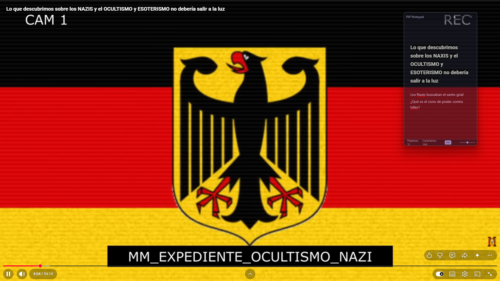
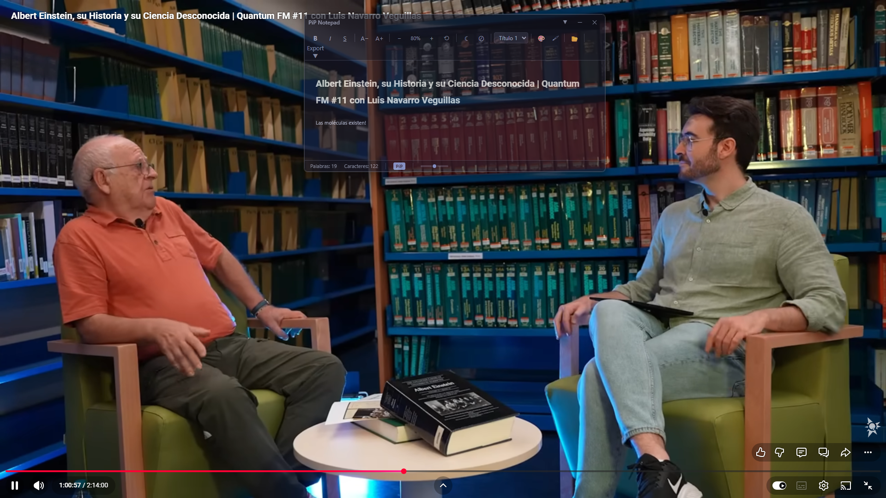

<p align="center">
  
</p>

<p align="center">
  
  
  
  
</p>

# PiP Notepad

Editor de texto flotante **Picture-in-Picture** para tomar notas mientras ves videos, clases o cualquier contenido en pantalla completa.

## 🎯 Caso de uso principal

Estás en clase viendo un video a pantalla completa y necesitas tomar notas sin cambiar de ventana. PiP Notepad flota **siempre encima** de cualquier aplicación, permitiéndote escribir sin interrupciones.

## 📸 Capturas

<p align="center">
  
  <br/>
  <em>Editor con colores, resaltados y headings</em>
</p>

<p align="center">
  
  <br/>
  <em>Exportación a HTML o texto plano</em>
</p>

## ✨ Características

- **Always-on-top** — flota sobre cualquier ventana, incluyendo videos en pantalla completa
- **Transparencia ajustable** — slider de opacidad para ver el contenido detrás
- **Formato de texto** — negrita, cursiva, subrayado, tamaño de fuente, headings
- **Color de texto** — 8 colores de alto contraste (rojo, naranja, verde, azul, violeta, etc.)
- **Resaltado pastel** — 5 colores para destacar ideas (amarillo, verde menta, rosa, azul cielo, lavanda)
- **Zoom** — ajusta el tamaño del texto usando todo el ancho disponible
- **Click-through** — los clics pasan a través de la ventana; escapa con Ctrl+Shift+K
- **Toolbar colapsable** — ahorra espacio cuando la ventana es pequeña (Ctrl+T)
- **Tema claro/oscuro** — toggle con persistencia
- **System tray** — minimiza a la bandeja del sistema
- **Autosave** — guarda automáticamente cada 5 segundos
- **Exportación** — a HTML (conserva TODO el formato) o texto plano
- **Importación** — abre archivos .html, .txt y .md (Ctrl+O)
- **Portable** — no requiere instalación ni permisos de administrador

## 🛠️ Stack tecnológico

| Componente | Tecnología |
|-----------|------------|
| Shell | Tauri 2.x (Rust) |
| Frontend | TypeScript + Vite |
| Editor | contentEditable + execCommand |
| Sanitización | DOMPurify |
| Markdown | marked + Turndown |
| Ventana PiP | WS_EX_TOPMOST, transparent, skipTaskbar |

## 📦 Instalación

Descarga el ejecutable desde [Releases](https://github.com/juanjoselopez/pip-notepad/releases) o compílalo tú mismo:

```bash
pnpm install
pnpm tauri build
```

El `.exe` portátil estará en `src-tauri/target/release/pip-notepad.exe`.

## ⌨️ Atajos de teclado

| Atajo | Acción |
|-------|--------|
| Ctrl+B | Negrita |
| Ctrl+I | Cursiva |
| Ctrl+U | Subrayado |
| Ctrl+= / Ctrl+- | Acercar / Alejar |
| Ctrl+0 | Restablecer zoom |
| Ctrl+S | Exportar |
| Ctrl+O | Abrir archivo (.html, .txt, .md) |
| Ctrl+T | Ocultar / Mostrar toolbar |
| Ctrl+Shift+C | Menú color de texto |
| Ctrl+Shift+H | Menú resaltar |
| Ctrl+Shift+K | Activar / Desactivar click-through |

## 🚀 Desarrollo

```bash
# Instalar dependencias
pnpm install

# Modo desarrollo (hot-reload)
pnpm tauri dev

# Compilar release
pnpm tauri build
```

## 📄 Licencia

MIT © [juanjoselopez](https://github.com/juanjoselopez)
